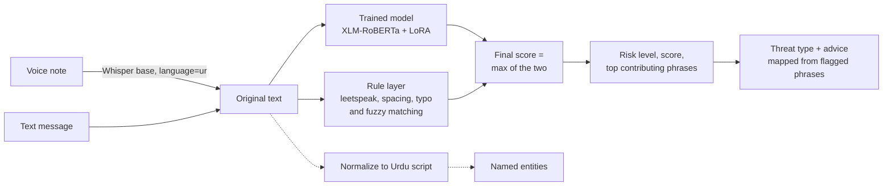

# UrduStack

**Scam and abuse detection for code-switched Pakistani text: Roman Urdu, Urdu script and English, often in the same message.**

UrduStack scores a message for scam or toxic content, shows which phrases drove the score, maps it to a threat
type (fake job posting, phishing or harassment) and returns specific advice. It is self-hostable: a 4.5 MB LoRA
adapter on the open `xlm-roberta-base` model, with no third-party API calls.

Built for the Bano Qabil × Alibaba Cloud AI Hackathon 2026 (Urdu & Regional Tech track).

📄 [Technical report](docs/report/UrduStack_Technical_Report.pdf) (see [Report corrections](#report-corrections))

---

## Contents

- [The problem](#the-problem)
- [How it works](#how-it-works)
- [Results](#results)
- [Features and their status](#features-and-their-status)
- [Getting started](#getting-started)
- [API reference](#api-reference)
- [Model and data](#model-and-data)
- [Project structure](#project-structure)
- [Testing](#testing)
- [Known limitations](#known-limitations)
- [Roadmap](#roadmap)
- [Report corrections](#report-corrections)
- [Contributors](#contributors)

---

## The problem

Scam and harassment messages in Pakistan are usually written the way people actually type: Roman Urdu mixed
with English, sometimes Urdu script, often with deliberate misspellings.

```
job hai bhai 50000 per week fee bhejo
j0b availabl3, 50000 p3r w33k, s3nd pr0c3ssing f33
j o b  a v a i l a b l e,  s e n d  p r o c e s s i n g  f e e
```

English keyword filters don't know Roman Urdu vocabulary, and a single zero or space defeats them. Most Urdu NLP
models expect Urdu script. UrduStack is built for the mixed case.

## How it works



- **Two independent detectors.** The trained model reads the original text (XLM-RoBERTa's pretraining already
  covers romanized Urdu). The rule layer undoes leetspeak, character spacing and known misspellings, then matches
  12 scam phrases and 22 abusive or scam words. The final score is the higher of the two, so either can raise the
  alarm.
- **Explanations.** Each word's contribution is measured by removing it and re-scoring; the top five are returned,
  merged with any phrases the rules matched.
- **Risk levels.** `high` ≥ 0.7, `medium` ≥ 0.4, otherwise `low`. The model's probability is temperature-calibrated
  (T = 1.41).
- **Context (dotted lines).** Normalization to Urdu script and named-entity extraction are shown alongside the
  verdict. They do not affect the score or the advice.

All three interfaces (website, Gradio playground, WhatsApp bot) use the same scoring code, so they always return
the same verdict.

## Results

### Evaluation set (107 hand-written messages)

Full system (model + rules), threshold 0.4. Source: [`tests/eval_results_full_t0.4.csv`](tests/eval_results_full_t0.4.csv).

| | Accuracy | Precision | Recall | F1 |
|---|---|---|---|---|
| Rules only | 79.4% | 92.6% | 55.6% | 69.4% |
| **Model + rules** | **89.7%** | **92.5%** | **82.2%** | **87.1%** |

Adding the trained model raises recall by 27 points at the same precision. The rules-only row is reproduced by
scoring [`tests/eval_dataset.csv`](tests/eval_dataset.csv) with `app.utils.risk.compute_risk_score`.

| Category | Correct |
|---|---|
| Benign chat | 30 / 32 |
| Code-switched benign | 10 / 10 |
| Tricky benign (negation, money talk) | 18 / 19 |
| Scam (incl. one legitimate job ad) | 22 / 25 |
| Toxic | 16 / 21 |

Errors: 3 false alarms and 8 misses, all listed in the results CSV.

**How to read these numbers:**

- The set is small: 95% confidence interval for accuracy ≈ 82.5–94.2%, for recall ≈ 68.7–90.7%.
- All messages were written by the team, in Roman Urdu and English only. There are no Urdu-script cases yet.
- Ten of the messages are the adversarial cases below, and the rule layer was tuned on them. A few scam messages
  closely resemble the synthetic training templates. Treat this as a development benchmark, not a held-out test.

### Adversarial cases (12)

Leetspeak, character spacing, misspellings and mixed-script text. Source:
[`tests/adversarial_results_model.csv`](tests/adversarial_results_model.csv).

| | Correct |
|---|---|
| Model alone | 9 / 12 (misses the leetspeak and letter-spaced cases) |
| Model + rules | 12 / 12 at threshold 0.4 (10 scored HIGH, 2 MEDIUM) |

The rules catch the obfuscated cases because they contain the specific phrases in these tests. Obfuscated versions
of phrases the rules don't know depend on the model alone.

### New-phrase probe (11)

Phrases written after training, scored by the model alone. Source:
[`tests/novel_probe_results.csv`](tests/novel_probe_results.csv).

- **Caught (7):** a security-deposit scam, a bank-transfer request, an investment scam, an "easy money" offer, and
  three insults.
- **Missed (4):** a direct threat (`jaan se maar doonga`, 0.10), a Roman-Urdu fee request
  (`bhai fee bhej do job pakki hai`, 0.04), a "verification charges" scam (0.18), a gift-card romance scam (0.01).

## Features and their status

| Feature | Status |
|---|---|
| Risk scoring (model + rules) | Core feature. Measured above |
| Phrase-level explanation | Working. Removes each word and re-scores the message |
| Threat type and advice | Working for 3 types: fake job posting, phishing, harassment. Mapped from flagged phrases, not predicted by the model |
| Code-switch normalization | 481-word dictionary → character-trigram retrieval over 597 phrases → phonetic fallback. Display only. English words are currently transliterated too |
| Named entities | `Davlan/xlm-roberta-base-wikiann-ner` on the normalized text. Informational only; quality is uneven |
| Speech input | Whisper `base` with `language="ur"`; the transcript goes through the same pipeline. Not yet evaluated (no WER) |
| Plain-language explanation | Experimental. 19-word simplification lexicon; currently produces poor output (see limitations) |
| Feedback | `/feedback` logs corrections to `data/feedback.csv`; `scripts/consume_feedback.py` turns them into a retraining CSV |

## Getting started

### Live demo in Colab

Open [`notebooks/launch_demo.ipynb`](notebooks/launch_demo.ipynb) in Google Colab, select a T4 GPU runtime and run
all cells. The trained adapter is already in the repo; the base model, NER model and Whisper download on first use.
The last cell prints a public Gradio link (valid for 72 hours).

### Run the API locally

```bash
pip install -r requirements.txt
uvicorn app.main:app --reload
```

Interactive docs at http://127.0.0.1:8000/docs, website at http://127.0.0.1:8000/.

If PyTorch or Transformers are not installed, the API still starts and scores with the rule layer only.

### Run the Gradio playground

```bash
python playground.py
```

Three tabs: Text Analysis, Speech Analysis, and a Comparison against a naive English-keyword baseline.
Set `SHARE=1` for a public link.

### Run with Docker

```bash
docker build -t urdustack .
docker run -p 7860:7860 urdustack
```

Serves the API and website at `/` and the playground at `/playground`.

### Run the WhatsApp bot (Twilio sandbox)

```bash
python whatsapp_bot.py   # port 5000; expose with ngrok and set the Twilio webhook to /whatsapp/webhook
```

The bot runs the scorer in-process. Twilio request-signature validation is not implemented yet.

### Configuration

| Variable | Purpose | Default |
|---|---|---|
| `RISK_MODEL_PATH` | LoRA adapter directory | `models/risk_lora` |
| `RISK_TEMPERATURE_PATH` | Calibration temperature file | `models/temperature.txt` |
| `CORS_ALLOW_ORIGINS` | Comma-separated allowed origins | `*` |
| `SHARE` | Public Gradio link for the playground | off |
| `TWILIO_FROM` | WhatsApp sender for the bot | Twilio sandbox number |
| `URDUSTACK_API_URL` | API base URL used by the HTTP test scripts | `http://localhost:8000` |

## API reference

| Method | Endpoint | Input | Output |
|---|---|---|---|
| GET | `/health` | — | `{status, models_loaded}` (models load on first use) |
| POST | `/normalize` | `{text}` | `{normalized, confidence, segments}` |
| POST | `/risk-score` | `{text}` | `{score, confidence, risk_level, flagged_phrases, threat_categories, primary_category, explanation, debug_scores}` |
| POST | `/transcribe` | audio file | `{text, confidence}` (confidence is not yet computed and is always 0) |
| POST | `/ner` | `{text}` | `{entities}` |
| POST | `/simplify` | `{text}` | `{simplified, changes, complexity_ratio}` |
| POST | `/analyze` | `{text}` | Full pipeline: normalized text, risk score and level, flagged phrases, threat type, entities, explanation, recommendation, debug scores |
| POST | `/feedback` | `{text, score, confidence, correct_label, comment?}` | `{status}` |

```bash
curl -X POST http://127.0.0.1:8000/risk-score \
  -H "Content-Type: application/json" \
  -d '{"text": "job hai bhai 50000 per week fee bhejo"}'
```

`debug_scores` reports the model score, the rule score and which one set the final score.

## Model and data

### Training

| Setting | Value |
|---|---|
| Base model | `xlm-roberta-base` |
| Adapter | LoRA on attention `query` and `value`, r = 16, α = 32, dropout 0.1, classifier head trained (4.5 MB) |
| Optimisation | lr 2e-4, batch 16, up to 5 epochs, early stopping (patience 2, validation F1), class-weighted cross-entropy, FP16 on a Colab T4 |
| Split | 70k train / 5k validation / 5k test, max length 128 tokens |
| Calibration | Temperature scaling, grid search over 100 values in [0.5, 5.0] on validation: T = 1.41 |

Training script: [`scripts/train_risk_model.py`](scripts/train_risk_model.py); full pipeline:
[`notebooks/train_risk_model_colab.ipynb`](notebooks/train_risk_model_colab.ipynb).

### Datasets

| Dataset | Role |
|---|---|
| [`hafiz-hassaan-saeed/Roman-Urdu-Toxic-Corpus`](https://huggingface.co/datasets/hafiz-hassaan-saeed/Roman-Urdu-Toxic-Corpus) (72.7k) | Main toxic vs clean data (Roman Urdu) |
| [`community-datasets/roman_urdu_hate_speech`](https://huggingface.co/datasets/community-datasets/roman_urdu_hate_speech) | Extra abusive examples (coarse-grained labels, inverted to 1 = toxic) |
| [`hamza-amin/urdu-spam-dataset`](https://huggingface.co/datasets/hamza-amin/urdu-spam-dataset) | Spam examples |
| [`scripts/generate_scam_data.py`](scripts/generate_scam_data.py) | 1,500 synthetic scam messages from 60 templates (815 unique); 7 scam types; 70% Roman Urdu, 30% Urdu script |
| [`Mavkif/Roman-Urdu-Parl-split`](https://huggingface.co/datasets/Mavkif/Roman-Urdu-Parl-split) (6.37M pairs) | Source for an optional Roman → Urdu frequency map ([`scripts/build_normalizer_map.py`](scripts/build_normalizer_map.py)); built in Colab, not included in the repo |

## Project structure

```
UrduStack/
├── app/
│   ├── main.py                 FastAPI app, CORS, website at /
│   ├── api/endpoints.py        8 API routes
│   ├── models/
│   │   ├── model_manager.py    Loads models on first use; analyze_text() pipeline; advice
│   │   ├── risk_model.py       LoRA scorer, max-of-two combination, word contributions
│   │   └── ner_model.py        Named-entity extraction
│   └── utils/
│       ├── risk.py             Rule layer and threat categories
│       ├── normalization.py    Roman Urdu → Urdu script cascade
│       ├── roman_urdu_map.py   481-word dictionary
│       ├── rag_normalize.py    Character-trigram retrieval (FAISS)
│       ├── transliterate.py    Phonetic fallback
│       ├── simplify.py         Simplification lexicon
│       ├── transcription.py    Whisper speech-to-text
│       └── pdf_report.py       PDF export of an analysis
├── models/risk_lora/           Trained LoRA adapter + tokenizer
├── models/temperature.txt      Calibration temperature
├── data/processed/             Retrieval phrase pairs
├── scripts/                    Training, synthetic data, frequency map, feedback consumer
├── notebooks/                  Colab training, evaluation and demo launcher
├── tests/                      Unit tests, evaluation and adversarial scripts, committed results
├── static/index.html           Website
├── playground.py               Gradio playground
├── whatsapp_bot.py             WhatsApp bot (Flask + Twilio)
├── app.py                      Docker / Spaces entrypoint
└── docs/                       Technical report, presentation, diagrams, screenshots
```

## Testing

```bash
pip install pytest
pytest tests/test_unit.py -v          # 46 unit tests
python tests/test_adversarial_ci.py   # rule-layer regression suite
```

GitHub Actions runs both on every push, without the ML dependencies.

Evaluating the trained model (needs PyTorch, Transformers, PEFT):

```bash
python tests/run_evaluation.py            # 107-message evaluation set
python tests/run_adversarial_colab.py     # 12 adversarial cases
```

## Known limitations

**Detection**
- Misses some direct threats (`jaan se maar doonga` → 0.10) and Roman-Urdu fee requests without English keywords.
- Over-flags some short inputs: `salary` → 0.99, `50000 100000 25000` → 1.00, a university fee notice → 0.98.
  Likely learned from number patterns in the synthetic scam templates.
- The rule layer's fuzzy matching flags some everyday words (e.g. `karna`, `kaisa`, `mahina`, `thori`) as abusive,
  because they are within one or two letters of a listed insult. Because the final score is the higher of the two detectors, these produce MEDIUM verdicts on
  harmless messages.
- Not yet evaluated on Urdu-script text.

**Output**
- Advice and explanations are in English.
- The "plain language" Urdu explanation is produced by transliterating the English explanation and is not readable.
- The confidence shown is the model's confidence even when the rule layer set the final score.
- Normalization transliterates English words (English-word detection does not trigger), and its "confidence" is the
  share of words changed, not accuracy.
- Entity character offsets can be wrong when a dictionary entry expands to two words.

**System**
- No input-length limit; explanation re-scores the message once per word, so long inputs are slow.
- The WhatsApp bot does not validate Twilio signatures and is not deployed as an always-on service.
- `scripts/consume_feedback.py --merge_into` keeps the existing label when a corrected text is already in the training set.
- No measured latency, Whisper accuracy or comparison against an LLM yet.

## Roadmap

1. Independent test set including Urdu script, labelled by people outside the team.
2. Retrain with threat vocabulary, real scam messages and varied harmless short texts.
3. Restrict fuzzy matching to unknown words; fix English-word detection.
4. Urdu and Roman-Urdu advice and explanations.
5. Always-on deployment and a pilot with a job group or university career office.
6. Benchmark against an LLM (e.g. Qwen) on the same evaluation set.

## Report corrections

The technical report was written at submission time. Where it differs from this README, this README is current:

- The evaluation set is hand-written and partly used for tuning; it is not a held-out set.
- The normalization dictionary has 481 entries and the retrieval index 597 phrases (report: 485 and 587).
- LoRA is applied to `query` and `value` only; early stopping uses validation F1.
- Normalization does not feed the classifier, and English words are not passed through unchanged.
- Of the 11 new-phrase probes, 6 match some rule-layer keywords (report: "none").
- Two of the 12 adversarial cases score MEDIUM rather than HIGH.
- The playground has 3 tabs (report: 4); speech confidence is not computed.

## Contributors

| Name | Role |
|---|---|
| Munaza Tariq | Development |
| Shahoud Shahid | Development |

## License

MIT. See [LICENSE](LICENSE).
